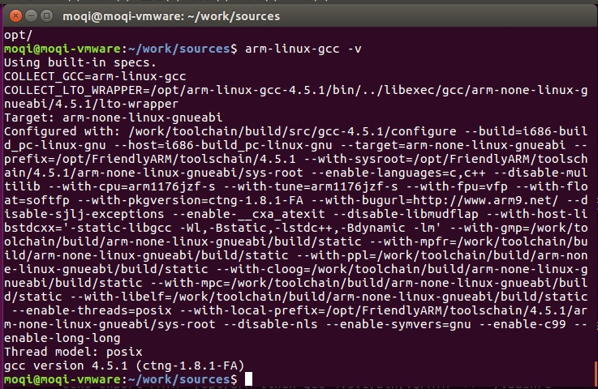

===========================================================
安装交叉编译链
===========================================================

以下操作均在ubuntu164下普通用户权限下操作，如果有更改用户会特别提醒。

-----------------------------------------------------------
一 获取交叉编译链
-----------------------------------------------------------

可以直接在我的github上获取 

.. code::

	git clone https://github.com/moqi-smile/Tiny4412-sources.git

我都是将交叉编译链放在 /opt 下, 你们可以将放在其他地方。 如果你们放在了其他地方的话，设置环境变量的时候就需要修改一下路径。

.. code::

	sudo mv Tiny4412-sources/arm-linux-gcc-4.5.1/ /opt/

-----------------------------------------------------------
二 设置环境变量
-----------------------------------------------------------

我的交叉编译链放在了opt下， 所以设置交叉编译链时，路径是/opt/交叉编译链的文件夹名称/bin。你们设置的时候可以按照你们更改的路径来修改，最好是使用绝对路径而不是相对路径。

.. code::

	echo export PATH="/opt/arm-linux-gcc-4.5.1/bin/:$PATH" >> ~/.bashrc
	source ~/.bashrc

-----------------------------------------------------------
三 检验安装是否成功
-----------------------------------------------------------

在命令行下输入

.. code::

	arm-linux-gcc -v

如果有输出以下日志, 则证明安装成功

其中 4.5.1 是交叉编译链版本号, 如果你的编译链跟我的不一样, 这里输出的就不一样

------------------------------------------------------------
四 解决安装编译链时的错误
------------------------------------------------------------

在这里会统计一下所有可能会出现的错误, 以后统一在这里解决

- 提示没有这个文件

先检验是否有操作错误。 如果没有操作错误，则原因是你使用了64位的系统，而交叉编译链是32位的。这个时候只需要安装兼容库就可以了。指令是:

.. code::

	sudo apt-get install lib32ncurses5
	sudo apt-get install lib32z1

