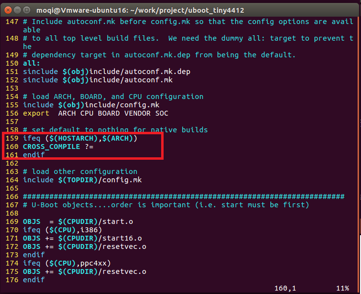
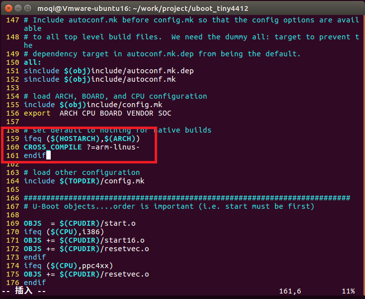
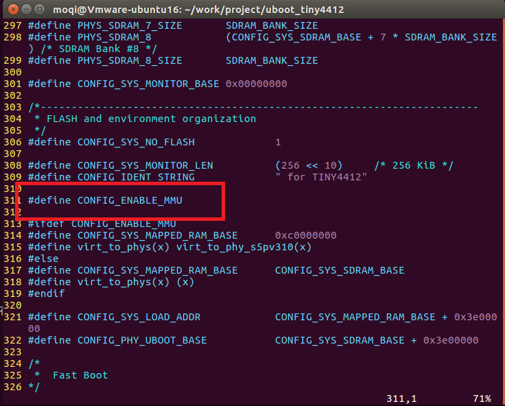
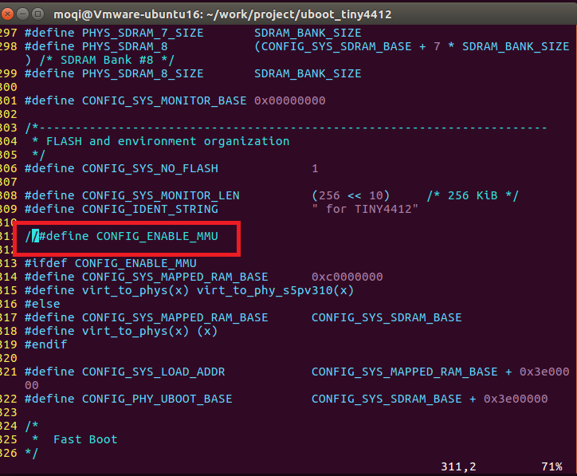
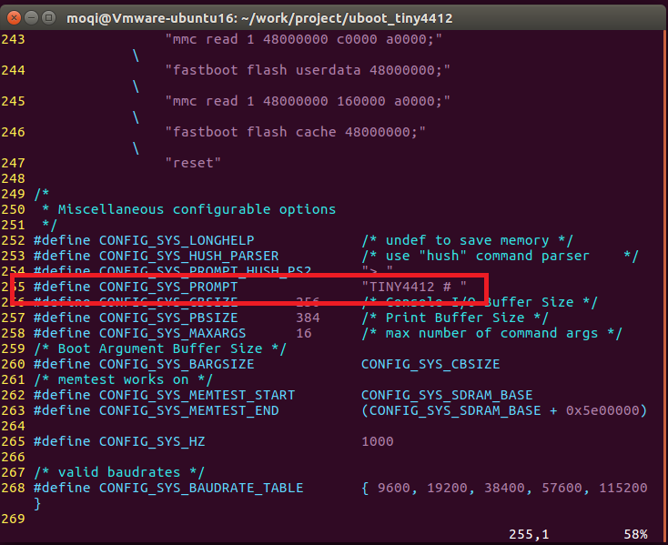
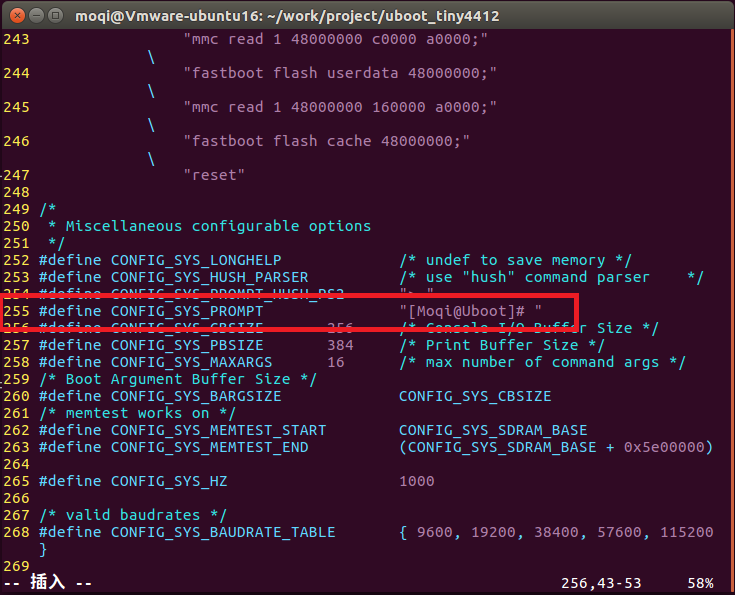
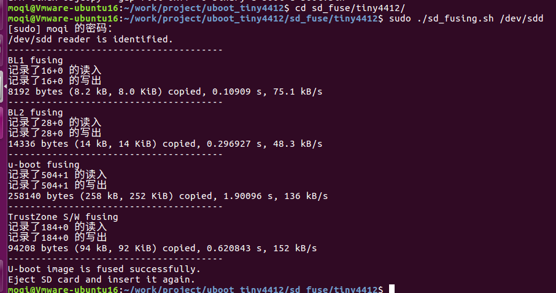
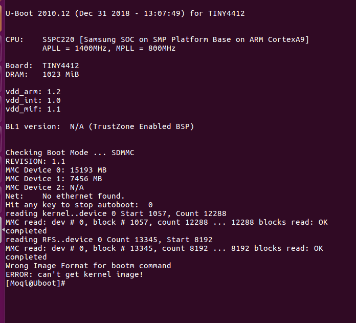

===========================================================
编译 U-Boot
===========================================================

以下操作均在ubuntu164下普通用户权限下操作，如果有更改用户会特别提醒。

-----------------------------------------------------------
一 获取 u-Boot
-----------------------------------------------------------

可以直接在我的github上获取

.. code::

    git clone https://github.com/moqi-smile/Tiny4412-sources.git

也可以在友善之臂的官方github里获取

.. code::

	https://github.com/friendlyarm/uboot_tiny4412.git

-----------------------------------------------------------
二 配置与修改 u-Boot
-----------------------------------------------------------

首先进入到u-Boot的文件夹下, 然后将配置一个你要编译的开发板

.. code::

	make tiny4412_config

接下来我们设置交叉编译链，在顶层目录下的Makefile下搜索 **CROSS_COMPILE** 在160行那里

在后面添加我们要使用的交叉编译链

接下来我们将MMU关闭, 打开 **include/configs/tiny4412.h**, 搜索MMU会看到以下内容

将 CONFIG_ENABLE_MMU 注释掉

u-boot启动的时候会有一个命令行提示符, 如果你们想要更改的话也可以在这个文件夹内更改，搜索 **CONFIG_SYS_PROMPT** 会出现

你可以将后面的定义改为自己喜欢的，我就将它改为

因为我们关闭了MMU, 所以也需要将链接地址更改, 打开文件 board/samsung/tiny4412/config.mk 将里面的

.. code::

	CONFIG_SYS_TEXT_BASE = 0xc3e00000

更改为

.. code::

	CONFIG_SYS_TEXT_BASE = 0x43e00000

到这里修改便已经结束了。只要在顶层目录下输入 **make** 就会开始编译 u-boot.

-----------------------------------------------------------
三 下载 u-Boot
-----------------------------------------------------------

下面我们将已经编译好了的u-boot下载到内存卡，首先插入SD卡。我的sd卡插入以后，便识别为sdd。
在u-boot顶层目录下有一个文件夹叫 **sd_fuse** ，进入到这个文件夹以后，编译一下。会生成一个叫做tiny4412的文件夹。进入这个文件夹，输入

.. code::

	sudo ./sd_fusing.sh /dev/sdd

如果输出

证明你已经下载成功，把内存卡插入到板子上, 会输出以下内容，则已经大功告成。

