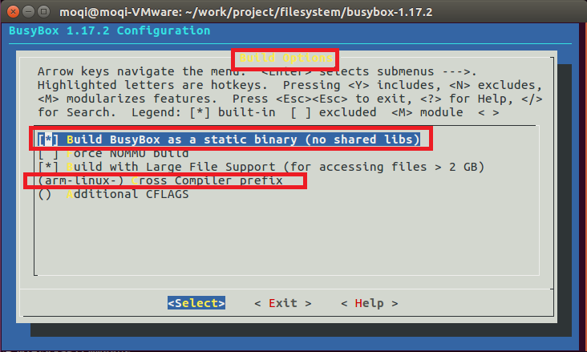
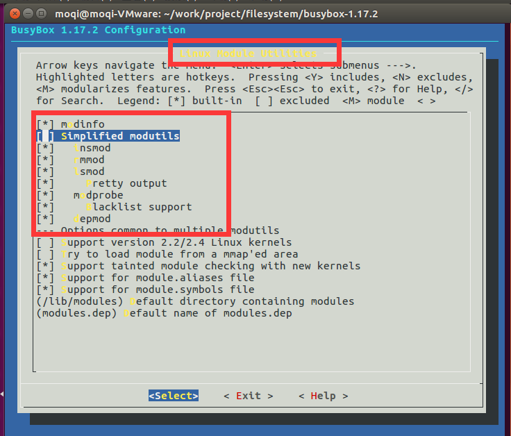
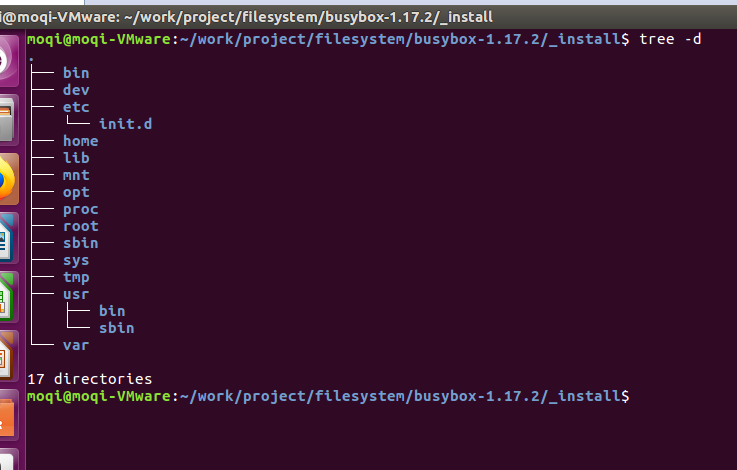

===========================================================
编译自己的Linux系统
===========================================================

接下来给我们的开发板制作linux内核与文件系统，我们会用友善之臂所使用的 。

.. note::

    推荐使用32位的linux系统，因为友善之臂给的交叉编译链与，都是32位的。如果你当前已经是64位的系统也不怕，只需要安装32位的兼容工具就好了。

-----------------------------------------------------------
一. 编译Linux内核
-----------------------------------------------------------

-----------------------------------------------------------
二. 制作文件系统
-----------------------------------------------------------

***********************************************************
1. 获取 busybox
***********************************************************

我使用的是 busybox-1.30.1，可以在官网获取最新版。

***********************************************************
2. 配置 busybox
***********************************************************

首先解压busybox并进入到busybox源码目录

.. note::

    tar xvf busybox-1.17.2-20101120.tgz && cd busybox-1.17.2/

我们需要先给busybox设置默认配置

.. note::

    make defconfig

接下来进入菜单配置busybox

.. note::

    make menuconfig

选择以下选项

.. code::

    Busybox Settings  --->
        Build Options  --->
            [ ] Build static binary (no shared libs)

将该选项勾选以后，编译出来的可执行文件将不依赖动态库，而是使用静态库。

在这个选项下面还有一个 Cross compiler prefix 需要我们设置，这里是配置交叉编译链前缀的地方。我使用的是友善之臂给的编译链，所以我输入的是 arm-linux-。修改完以后如下图。

接下来退到最顶层菜单

取消以下选项

.. code::

    Linux Module Utilities  --->
    [*] Simplified modutils

然后将弹出来的所有选项勾选上，选完以后如下图。

然后退出菜单，保存配置。接下来编译并安装busybox

.. code::

    make && make install

执行完以后，在当前目录下会出现一个_install文件夹，进入到该文件夹

.. code::

    cd _install

该文件夹存放着我们编译完的文件系统。但这个文件系统还不完全,还需要我们创建其他的文件夹。

.. code::

    mkdir proc sys dev tmp mnt root home opt var

在交叉编译链里获取 lib

.. code::

    cp -rf /opt/arm-linux-gcc-4.5.1/arm-none-linux-gnueabi/sys-root/lib/ .

在busybox源码目录下获取 etc 文件夹

.. code::

    cp  -rf ../examples/bootfloppy/etc/ ./

复制完以后, 我们创建的文件系统就像下图所示

