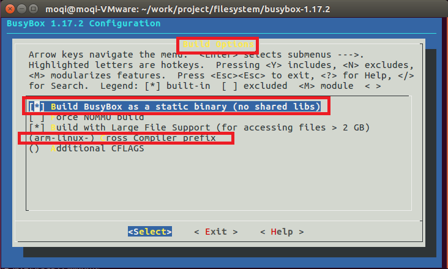
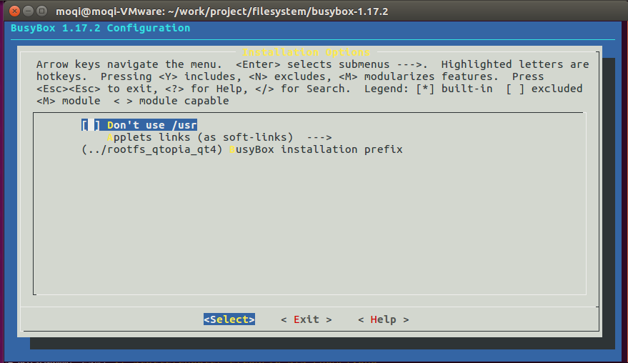
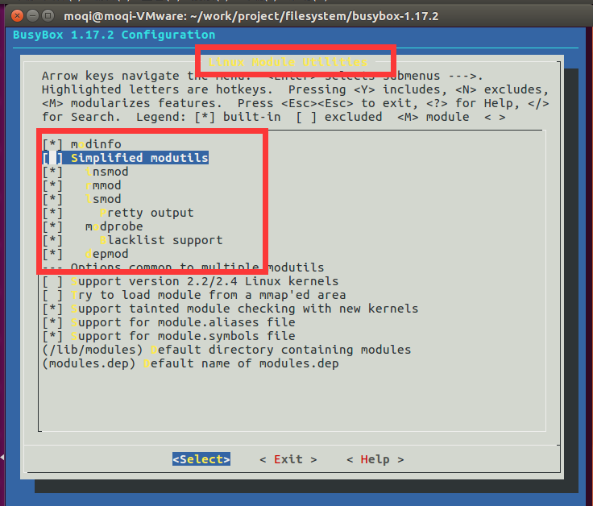
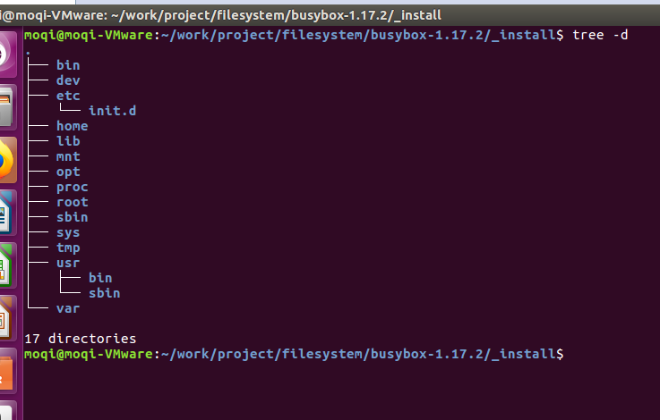
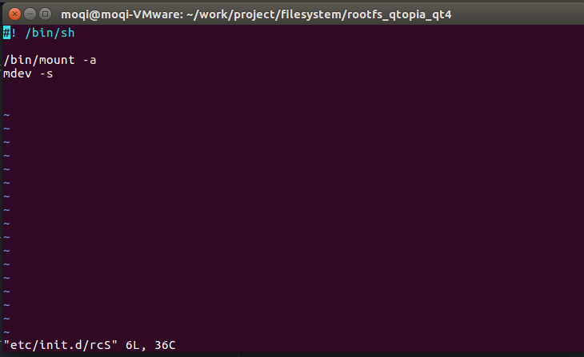
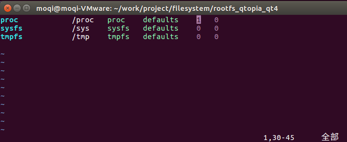
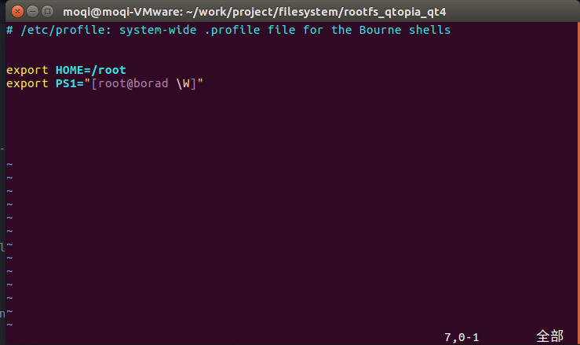

===========================================================
编译自己的Linux系统
===========================================================

接下来给我们的开发板制作linux内核与文件系统，我们会用友善之臂所使用的 。

.. note::

	推荐使用32位的linux系统，因为友善之臂给的交叉编译链与，都是32位的。如果你当前已经是64位的系统也不怕，只需要安装32位的兼容工具就好了。

-----------------------------------------------------------
一. 编译Linux内核
-----------------------------------------------------------

-----------------------------------------------------------
二. 制作文件系统
-----------------------------------------------------------

***********************************************************
1. 获取 busybox
***********************************************************

我使用的是 busybox-1.30.1，可以在官网获取最新版。

***********************************************************
2. 配置 busybox
***********************************************************

首先解压busybox并进入到busybox源码目录

.. code::

	tar xvf busybox-1.17.2-20101120.tgz && cd busybox-1.17.2/

我们需要先给busybox设置默认配置

.. code::

	make defconfig

接下来进入菜单配置busybox

.. code::

	make menuconfig

选择以下选项

.. code::

	Busybox Settings  --->
		Build Options  --->
			[ ] Build static binary (no shared libs)

将该选项勾选以后，编译出来的可执行文件将不依赖动态库，而是使用静态库。

在这个选项下面还有一个 Cross compiler prefix 需要我们设置，这里是配置交叉编译链前缀的地方。我使用的是友善之臂给的编译链，所以我输入的是 arm-linux-。修改完以后如下图。

接下来修改文件系统的安装路径，退一层，有以下选项

.. code::

    Installation Options  --->
        (./_install) BusyBox installation prefix

这个选项就是你编译完 BusyBox 以后文件系统的安装路经，我们将其改为在BusyBox 的上一层文件夹。修改完以后如下图。

~/work/project/filesystem/rootfs_qtopia_qt4/
接下来退到最顶层菜单

取消以下选项

.. code::

	Linux Module Utilities  --->
	   [*] Simplified modutils

然后将弹出来的所有选项勾选上，选完以后如下图。

然后退出菜单，保存配置。接下来编译并安装busybox

.. code::

	make && make install

执行完以后，在当前目录下会出现一个_install文件夹，进入到该文件夹

.. code::

    cd ../rootfs_qtopia_qt4/

该文件夹存放着我们编译完的文件系统。但这个文件系统还不完全，还需要我们创建其他的文件夹。

.. code::

	mkdir proc sys dev tmp mnt root home opt var

在交叉编译链里获取 lib

.. code::

	cp -rf /opt/arm-linux-gcc-4.5.1/arm-none-linux-gnueabi/sys-root/lib/ .

在busybox源码目录下获取 etc 文件夹

.. code::

	cp  -rf ../busybox-1.17.2/examples/bootfloppy/etc/ ./

复制完以后，我们创建的文件系统就像下图所示

接下来我们需要修改一些文件才能是内核正常使用这个文件系统。

首先修改 etc/init.d/下的 rcS 文件，这个文件在开发板上电以后会自动调用。我们在里面加入mdev命令，使其在上电以后帮助我们创建dev下的设备文件。

rcS里面还有一句 mount -a，该指令会调用etc 下的 fstab文件，挂载里面写好的文件系统

接下来我们修改 etc 下的 fstab，让这个文件会帮我们挂载内核需要文件系统 proc，sysfs与tmpfs。打开以后，如下图所示去修改。

我们在用户登录的时候会希望先设置好一些环境变量，这个时候就可以修改 etc 下的 profile 文件。我增加了两个环境变量，一个是用户的工作文档路径，一个是命令行提示符

到这里就修改完毕了。接下来我们将其做成一个镜像文件。

首先，我们需要一个工具 make_ext4fs。我发现用了友善之臂以外的 make_ext4fs 都无法制作出正确的镜像，可能友善之臂做了一些优化。所以暂时先使用友善之臂他们家的。可以在他们的网盘文件里获取，也可以在我的github里获取。

.. code::

	https://github.com/moqi-smile/Tiny4412-project/tree/master/tool

将这个文件移动到我们自己的系统的 usr/local/bin/ 文件夹下，然后进入到我们刚刚制作完的文件系统的上一层目录，输入以下指令

.. code::

	make_ext4fs -s -l 314572800 -a root -L linux rootfs_qtopia_qt4.img rootfs_qtopia_qt4

就会生成一个 rootfs_qtopia_qt4.img 文件，该文件就是我们想要的镜像文件。
