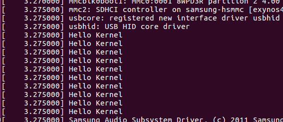

===========================================================
制作一个属于自己的驱动源码
===========================================================

-----------------------------------------------------------
一. 制作源码
-----------------------------------------------------------

首先我们先创建一个文件夹作为我们的源码目录

.. code::

    mkdir demo

然后创建两个文件。一个是源码文件 demo.c，另一个时用于编译源码的 Makefile

.. code::

    touch demo.c Makefile

打开 demo.c, 输入以下内容

.. code::

    #include <linux/init.h>
    #include <linux/module.h>
    #include <linux/sched.h>

    static __init int Demo_Init(void)
    {
            printk ("Hello Kernel\n");
            printk ("Hello Kernel\n");
            printk ("Hello Kernel\n");
            printk ("Hello Kernel\n");
            printk ("Hello Kernel\n");
            printk ("Hello Kernel\n");
            printk ("Hello Kernel\n");
            printk ("Hello Kernel\n");
            printk ("Hello Kernel\n");
            printk ("Hello Kernel\n");

            return 0;
    }

    module_init(Demo_Init);
    /* 模块初始化函数 */
    MODULE_LICENSE("GPL");
    /* 开源规则 */
    MODULE_AUTHOR("Moqi");
    /* 作者 */
    MODULE_VERSION("V1.0");
    /* 版本 */
    MODULE_DESCRIPTION("Demo");

当将该驱动编入内核中以后，内核源码就会调用 Demo_Init 函数来初始化该驱动。当系统启动以后就会打印 **Hello Kernel** ，为了防止系统启动以后打印过多日志而比较难找到该信息，我多打印了几次。
接下来制作 Makefile， 打开 Makefile 输入

.. code::

    obj-y += demo.o

最后整个文件夹复制到内核源码的 drivers 目录下

为了让源码知道这个目录, 还需要修改一下 drivers 的 Markfile 文件。打开Markfile ，在最后加入

.. code::

    obj-y                           += demo/

到这里就制作完毕了。只要再编译多一次源码， 然后将固件拷进开发板内，看看启动信息是否有 **Hello Kernel**。如果有，证明制作成功了。

